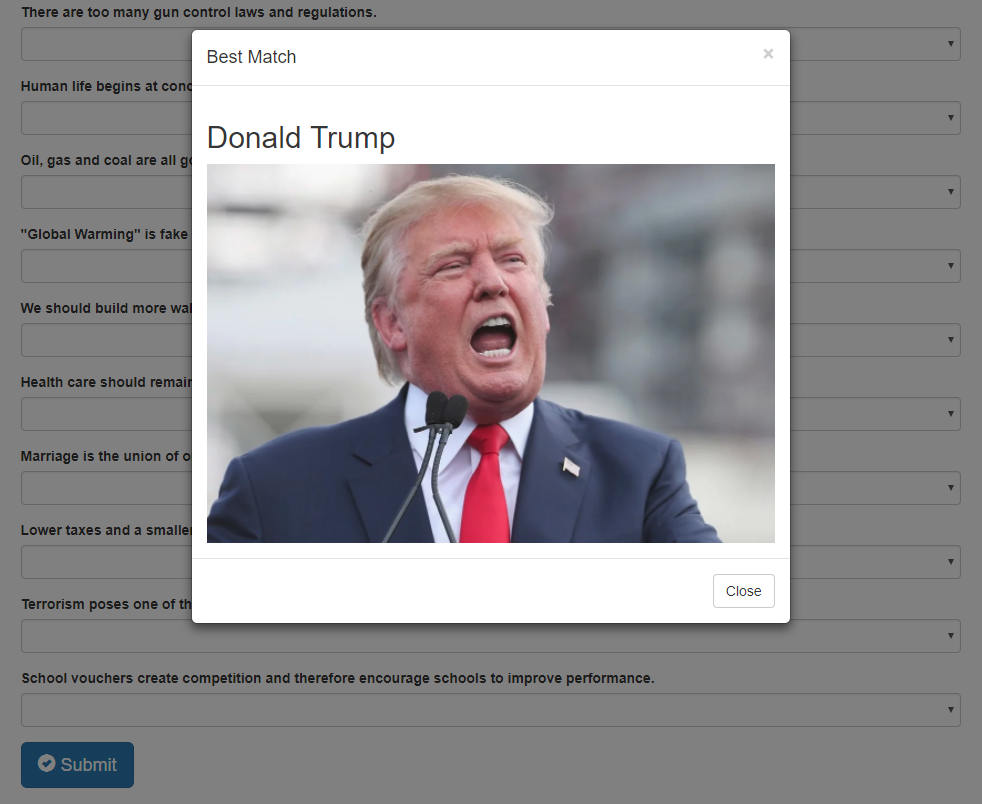

# Conservative Friend Finder

Created for a coding bootcamp assignment, the app provides the user a way to meet some fellow conservative-leaning "stable geniuses." Fill out a survey consisting of 10 thought-provoking questions and then find out your best overall match!

## Before You Begin

- If running locally, run `npm install` as the app makes use of [express](https://www.npmjs.com/package/express) and [body-parser](https://www.npmjs.com/package/body-parser) npm packages.

## Commands

- `node server.js`
  
  It should return `App listening on PORT: 3000`

  Point your browser to http://localhost:3000 and you should be good to go.
  
## Survey

Assuming you have everything setup correctly, click on  and start the survey.

All fields are required on the next screen, click 'submit' when you're done and you'll be treated to your best match. (Closest match will be the user with the least amount of difference.)

## API

Click on 'API Friends List' in the lower left-hand corner to display a JSON of all possible friends.

